## 0. 内容安排
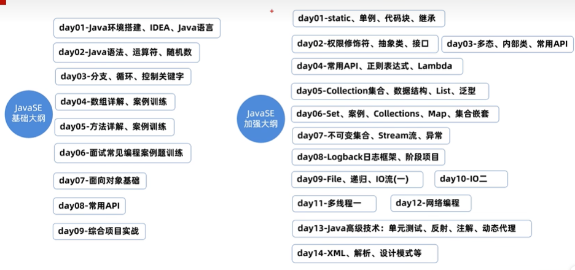

## 1.基础语法
### 1.1 注释
```aidl
# 单行注释
// 注释内容，只能写一行

# 多行注释
/*
    注释内容1
    注释内容2
*/

# 文档注释：此内容可以提取到一个程序说明文档中去的
/**
    注释内容
    注释内容
*/    
```

### 1.2 字面量
```aidl
# 概念：字面量就是告诉程序员，数据在程序中的书写格式。

# 变量：存储一个数据的内存区域，存储的数据可以变化。
# 注意：变量先申明再使用。
int a = 10;

# 数据类型：基本数据类型，引用数据类型(如：String)。
# 基本数据类型：4大类8种。
整数：        字节长度
    byte        1
    short       2
    int         4
    long        8
浮点数：
    float       4
    double      8
字符：
    char        2
布尔：
    boolean     1

# 关键字：保留的单词，有特殊功能。
class, break, if, while等

# 标识符：由一些字符组成的名称，给类、方法、变量等取名字。
# 要求：由数字、字母、下划线、$组成，不能以数字开头，区分大小写。
# 命名规范：
变量名称：studyNumber
类名称：  HelloWorld
```

## 2. 类型转换
### 2.1 自动类型转换
```aidl
# 类型范围小的变量，可以直接赋值给类型范围大的变量。
# byte --> short --> int --> long --> float --> double
#          char  --> int
byte a = 12;
char b = 'a';
int c = a;
int d = b;
System.out.println(c); //12
System.out.println(d); //97
```

### 2.2 表达式中类型转换
```aidl
# 在表达式中，表达式的最终结果类型由表达式中的最高类型决定；
# 在表达式中，byte，short，char是直接转换为int类型参与运算。
byte a = 1;
int b = 2;
char c = 'a';
int d = a + b + c;
System.out.println(d);  // 100
```

### 2.3 强制类型转换
```aidl
# 类型大范围的数据，不能直接赋值给类型小范围的数据。
# 可以使用这种方法强制转换：
    数据类型 变量2 = (数据类型)变量1；
# 注意：强制转换可能造成数据溢出，double转int直接丢掉小数部分返回。
int a = 20;
byte b = (byte)a;
```

## 3. 运算符
### 3.1 算术运算符
```aidl
+ 加
- 减
* 乘
/ 除
% 取余

# 加号除了作为算法运算符，还可以当作连接符
System.out.println("a="+a)
```

### 3.2 自增自减运算符
```aidl
++ 自增
-- 自减
```

### 3.3 赋值运算符
```aidl
+=  加后赋值
-=  减后赋值
*=  乘后赋值
/=  除后赋值
%=  取余后赋值
```

### 3.4 关系运算符
```aidl
==  判断是否相等
!=  判断是否不等
>   判断是否大于
>=  判断是否大于等于
<   判断是否小于
<=  判断是否小于等于
```

### 3.5 逻辑运算符
```aidl
&   逻辑与
|   逻辑或
!   逻辑非
^   逻辑异或（两个不同才是true）

&&  短路与（判断结果和“&”一样，但是如果左边是“false”，则右边不执行）
||  短路或（判断结果和“|”一样，但是如果左边是“true”，则右边不执行）
```

### 3.6 三元运算符
```aidl
# 条件表达式 ? 值1 : 值2
# 首先判断条件表达式，如果是true，则返回值1，否则返回值2.

# 例子1：两数判断最大值
int a = 100;
int b = 90;
int c = a > b ? a:b;
System.out.println(c)

# 例子2：三数判断最大值
int d = 10;
int e = 20;
int c = 30;
int max = d > e ? d > c ? d:c : e > c ? e:c
System.out.println(max)
```

### 3.7 运算符优先级
```aidl
优先级     运算符
1           ()
2           ! ~ ++ 
3           * / %
4           + -
......
注意：（）优先级最高。
```

## 4. 分支结构
### 4.1 if
```aidl
# if格式：
if(条件表达式){
    语句体；
}

if(条件表达式){
   语句体1；
} else {
    语句体2；
}

if(条件表达式1){
    语句体1；
} else if(条件表达式2){
    语句体2；
} else{
    语句体3；
}
```

### 4.2 switch
```aidl
# switch格式：
switch(表达式){
    case 值1：
        执行代码...；
        break；
    case 值2：
        执行代码...；
        break；
    ...
    default：
        执行代码n;
}

# 注意事项：
    case不能重复；
    case不能是变量，必须是确定的值；
    漏写break，会发生穿透。
```

### 4.3 for
```aidl
# for格式：
for (int i=0; i<10; i++){
    System.out.println(i)
}

# 例子1：求1-5之和
int sum = 0; 
for (int i=1; i<=5; i++){
    sum += i
}
System.out.println(sum)

# 例子2：求水仙花数
for (int i=100; i<=999; i++){
    int ge = i%10;
    int shi = i/10%10;
    int bai = i/100;
    if (ge*ge*ge + shi*shi*shi + bai*bai*bai == i){
        System.out.println(i)
    }
}
```

### 4.4 while
```aidl
# 格式：
int i = 0;
while (i<10){
    System.out.println(i);
    i++
}

# for和while使用场景的区别：当不知道循环多少次的时候，使用while。
```

### 4.5 do while
```aidl
# 格式：
int i = 0;
do{
    System.out.println(i);
    i++;
}while(i<=3);

# 注意：do-while一定会先执行一次循环体。
```

### 4.6 死循环
```aidl
# 格式1：
for(;;){
    循环体；
}

# 格式2：
while(true){
    循环体；
}

# 格式3：
do{
    循环体；
}while(true);
```

### 4.7 跳出控制语句
```aidl
# break：跳出并结束当前所在循环；
# continue：跳出本次循环，进入下一次循环。

# 注意：break只能用于循环当中，或者结束所在switch所在分支；
        continue只能用于循环当中。
```

### 4.8 案例：随机数Random类
```aidl
# 使用方法：
Random r = new Random();
int data = r.nextInt(10);
System.out.println(data);

# 例子：随机生成一个1-100之间的数字，提示用户猜测，猜大提示过大，猜小提示过小，直至结束。
Random r = new Random();
int luckyNumber = r.nextInt(100)+1;
Scanner sc = new Scanner(System.in);
while(true){
    System.out.println("请输入一个1-100之间的数字：");
    int guessData = sc.nextInt();
    if (guessData > data){
        System.out.println("数字过大");
    }else if (guessData < data){
        System.out.println("数字过小");
    }else{
        System.out.println("恭喜猜对了")；
        break;
    }
}
```

## 5. 数组
### 5.1 数组定义
```aidl
# 静态初始化数组
// 完整格式：
数组类型[] 数组名 = new 数据类型[]{元素1，元素2，元素3...};
doubel[] scores = new double[]{90.5, 80.5, 78.2};
int[] ages = new int[]{12, 24, 36};
// 简化格式：
数组类型[] 数组名 = {元素1，元素2，元素3...};
doubel[] scores = {90.5, 80.5, 78.2}; 

# 取值：
System.out.println(ages[0]);    // 12
# 赋值：
ages[0] = 20;
# 长度：
System.out.println(ages.length);    // 3
# 最大索引：
System.out.println(ages.length-1);  // 2

# 动态初始化
数组类型[] 数组名 = new 数据类型[长度];
int[] arr = new int[3];

# 动态初始化默认值
数据类型                    默认值
byte short char int long    0
float double                0.0
boolean                     false
类 接口 数组 String           null
```

### 5.2 数组遍历
```aidl
int[] ages = new int[]{10, 20, 30, 40};
for (i=0; i<ages.length; i++){
    System.out.println(ages[i]);
}

```
### 5.3 案例分析
```aidl
# 例子1：数组求和
int[] money = new int[]{100, 200, 300, 400};
int sum = 0;
for (i=0; i<money.length; i++){
    sum += money[i];
}
System.out.println("数组求和等于："+sum);

# 例子2：数组求最大的元素
int[] money = new int[]{100, 200, 300, 400};
int max = money[0];
for (i=1; i<money.length; i++){
    if (max < money[i]){
        max = money[i];
    }
}
```

### 5.4 内存分析
```aidl
int[] money = new int[]{100, 200, 300, 400};
# 注意：money 存放的是 数组的地址
```

## 6. 方法
### 6.1 定义
```aidl
# 定义格式：
修饰符 返回值类型 方法名(形参列表){
    方法体代码（需要执行的功能代码）;
    return 返回值;
}
# 调用格式：
方法名(...)

例子1：
public static int add(int a, int b){
    int c = a + b;
    return c;
}

例子2：
public static void print(){
    System.out.println("Hello World!");
    System.out.println("Hello World!");
    System.out.println("Hello World!");
}
```

### 6.2 案例
```aidl
# 案例1：定义一个方法，返回计算1-n的和。
public static int sum(int n){
    int sum = 0;
    for (int i=1; i<=n; i++){
        sum += i;
    }
    System.out.println("sum="+sum);
}

# 案例2：判断整数是奇数还是偶数。
public static void fun(int n){
    if (n%2 == 0){
        System.out.println(n + "是偶数");
    }else{
        System.out.println(n + "是奇数");
    }
}

# 案例3：数组求最大值。
int[] a = new int[]{10, 20, 30};
public static int maxArr(int[] a){
    max = a[0];
    for (int i=1; i<a.length; i++){
        if (max < a[i]){
            max = a[i];
        }
    }
}
```

### 6.3 参数传递
```aidl
# 基本数据类型参数传递
传递实参给形参的时候，传递的是实参中的值，也就是值传递。
public static void main(String[] args){
    int a = 10;
    change(a);
    System.out.println(a);
}
public static void change(int a){
    System.out.println(a);
    a = 20;
    System.out.println(a);
}
// 结果为：10 20 10

# 引用数据类型参数传递
传递实参给形参的时候，传递的是实参保存的地址值。
public static void main(String[] args){
    int[] arr = new int[]{10,20,30};
    change(arr);
    System.out.println(arr[1]);
}
public static void change(int[] arr){
    System.out.println(arr[1]);
    arr[1] = 222;
    System.out.println(arr[1]);
}
// 结果为：20 222 222
```

### 6.4 方法重载
```aidl
# 定义：同一个类中，出现多个方法名称相同，但是形参列表不同，这些方法就是重载方法。
public class Method{
    public static void main(String[] args){
        fire();
        fire("美国");
        fire("美国", 1000);
    }
    public static void fire(){
        System.out.println("发射！");
    }
    public static void fire(String location){
        System.out.println("向" + location + "发射！");
    }
    public static void fire(String location, int number){
        System.out.println("向" + location + "发射" + number + "枚炮弹！");
    }
}
```

### 6.5 单独使用return关键词
```aidl
public class Test{
    public static void main(String[] args){
        chu(1, 10);
    }
    public static void chu(int a, int b){
        if (b==0){
            System.out.println("输入有误！");
            return；
        }else{
            System.out.println("结果是：" + a/b);
        }
    }
}
```

## 7. 对象
### 7.1 创建
```aidl
# 创建类
public class 类名{
    1. 成员变量（代表属性，一般是名词）
    2. 成员方法（代表行为，一般是动词）
    3. 构造器
    4. 代码块
    5. 内部类
}

例如：
public class Car{
    // 属性（成员变量）
    String name;
    double price;
    // 行为（方法）
    public void start(){}
    public void run(){}
} 

# 创建类的对象
类名 对象名 = new 类名();
Car c = new Car();

# 注意事项：
1. 类名大写；
2. 一个Java文件中可以定义多个class（类），但是只能有一个是public。
```


### 7.2 案例
代码详见：[Object](code/src/Object/Shopping.java)

### 7.3 构造器
```aidl
# 作用：定义在类中，可以初始化一个类的对象，并返回对象的地址。
# 格式：
修饰符 类名(形参列表){
    ...
}
public class Car{
    // 无参构造器
    public Car(){}
    // 有参构造器
    public Car(String name, double price){}
}

# 调用：
类 变量名称 = new 构造器;
car c1 = new car();
car c2 = new car("奔驰", 39.8); 

# 注意：
1. 任何类定义出来，默认自带了无参数构造器
```
代码详见：[CarTest](code/src/Object/CarTest.java)

### 7.4 this
```aidl
# 作用：可以用于指定访问当前对象的成员变量、成员方法。
public class Car {
    String name;
    double price;
    public Car(){
        System.out.println("无参构造器被调用。");
    }
    public Car(String name, double price){
        System.out.println("有参数构造器被调用。");
        this.name = name;
        this.price = price;
    }
}
```
代码详见：[Car](code/src/Object/Car.java)

### 7.5 封装
```aidl
# 原则：对象代表什么，就得封装对应的数据，并提供数据对应的行为。
public class Age {
    private int age;
    public int getAge(){
        return age;
    }
    public void setAge(int age){
        if (age <= 200 && age >= 0){
            this.age = age;
        }else {
            System.out.println("年龄有误！");
        }
    }
}

public class AgeTest {
    public static void main(String[] args) {
        Age a = new Age();
        a.setAge(30);
        int age = a.getAge();
        System.out.println("年龄是：" + age);
    }
}
```
代码详见：[age](code/src/Object/AgeTest.java)

### 7.6 JavaBean
```aidl
# 书写要求：
1. 成员变量使用private修饰；
2. 提供成员变量对应的setXxx() / getXxx()方法；
3. 必须提供一个无参构造器，有参构造器可写可不写。
```
代码详见：[User](code/src/Object/UserTest.java)

### 7.7 成员变量和局部变量
|  区别  |        成员变量        |         局部变量         |
|:----:|:------------------:|:--------------------:|
| 类中位置 |       类中，方法外       |        常见于方法中        |
| 默认值  |        有默认值        |      没有默认值，需要赋值      |
| 生命周期 | 随着对象的创建而存在，对象消失则消失 | 随着方法的调用而存在，方法运行结束则消失 |
| 作用域  |        全对象内        |        所属方法内         |

### 7.8 案例
```aidl
# 案例：模仿电影信息展示。
```
代码详见：[Movie](code/src/Object/MovieTest.java)

### 7.9 总结
```aidl
面向对象编程（oop）
```

## 8. String
### 8.1 创建
```aidl
# 概述：java.lang.String类代表字符串，String类定义的对象用于指向字符串对象，然后操作该字符串。
# 特点：String类创建之后不能被修改。

String address = "深圳";
address += "大学";
address += "计算机与软件学院";
System.out.println(address);    // 深圳大学计算机与软件学院

解释：创建的String"深圳"、"大学"、"计算机与软件学院"都无法改变，address改变的原因是
每次连接都指向了新的对象，比如连接"大学"之后，address就指向了对象"深圳大学"的地址，
之前的String对象"深圳"和"大学"都没有改变。

# 构造方法：
方法一：String address = "深圳";
方法二：使用String类的构造器创建对象。
```
|       构造器        |        说明         |
|:----------------:|:-----------------:|
| public String()  |   空白字符串对象（几乎不用）   |
| public String(String original) |   传入字符串内容（几乎不用）   |
| public String(char[] chs) | 根据字符数组的内容，创建字符串对象 |
| public String(byte[] chs) | 根据字节数组的内容，创建字符串对象 |
```aidl
# 以""方式给出的字符串对象，在字符串常量池中存储，相同的内容只会存储一份。
# 通过构造器new对象，则每new一次就会产生一个新对象，放在堆内存中。
public class StringConstruct {
    public static void main(String[] args) {
        String s1 = "abc";
        String s2 = "abc";
        System.out.println(s1 == s2);   // true

        char[] chars1 = new char[]{'a', 'b', 'c'};
        String s3 = new String(chars1);
        String s4 = new String(chars1);
        System.out.println(s3 == s4);   // false
        
        byte[] byte1 = new byte[]{97, 98, 99, 65, 66, 67};
        String s5 = new String(byte1);
        System.out.println(s5);         // abcABC
    }
}
```
详见代码：[StringConstruct](code/src/String/StringConstruct.java)


### 8.2 常见面试题
```aidl
# 代码运行结果：
public class InterviewQuestion {
    public static void main(String[] args) {
        String s1 = new String("abc");  // 此行创建了两个对象，一个放在字符串常量池中，一个放在堆内存中。
        String s2 = "abc";  // 此行没有创建对象，如果没有上一行，则创建一个对象放在字符串常量池中。
        System.out.println(s1 == s2);   // false
        System.out.println("----------------------------");
        
        String s3 = "abc";
        String s4 = "ab";
        String s5 = s4 + "c";
        System.out.println(s3 == s5);   // false
        System.out.println("----------------------------");

        String s6 = "a" + "b" + "c";
        System.out.println(s3 == s6);   // true. 原因是：java存在编译优化机制，程序在编译时："a" + "b" + "c"会直接转成"abc".
    }
}
```
详见代码：[InterviewQuestion](code/src/String/InterviewQuestion.java)

### 8.3 String常见API
```aidl
# 案例1：字符串的内容比较，推荐使用String类提供的“equals”方法。
## equals: 只关心字符内容是否一致；
## equalsIgnoreCase: 忽略大小写。

## 错误示范：
// 1. 正确登录名和密码
String okName = "simon";
String okPassword = "123456";
// 2. 用户输入登录名和密码
Scanner sc = new Scanner(System.in);
System.out.println("登录名称：");
String name = sc.next();
System.out.println("登陆密码：");
String password = sc.next();
// 3. 判断用户登录名称密码是否和正确登录名密码相等
// 此种写法错误：字符串内容比较不适合用“==”比较。
if (okName == name && okPassword == password){
    System.out.println("登陆成功！");
}else {
    System.out.println("登入失败！");
}

## 正确示范：
if (okName.equals(name) && okPassword.equals(password)){
    System.out.println("登陆成功！");
}else {
    System.out.println("登入失败！");
}

// 4. 验证码：忽略大小写
String sysCode = "aBc1";
System.out.println("验证码：");
String code1 = sc.next();
System.out.println(sysCode.equalsIgnoreCase(code1));
```
代码详见：[StringEquals](code/src/String/StringEquals.java)

```aidl
案例2：其他例子
// 1. length: 字符串长度
System.out.println("--------------------");
String name = "我爱你中国";
System.out.println(name.length());  // 5

// 2. charAt(int index): 获取某个索引位置的字符
System.out.println("--------------------");
System.out.println(name.charAt(1)); // 爱
System.out.println("--------------------");
// 遍历字符串中每个字符
for (int i = 0; i < name.length(); i++) {
    System.out.println(name.charAt(i));
}

// 3. toCharArray: 把字符串转换为字符数组
System.out.println("--------------------");
char[] chars = name.toCharArray();
System.out.println(chars);
for (int i = 0; i < chars.length; i++) {
    System.out.println(chars[i]);
}

// 4. substring(int beginIndex, end endIndex): 根据索引进行截取，左闭右开
//    substring(int beginIndex): 从索引处一直截取到末尾
System.out.println("--------------------");
String name1 = name.substring(0, 3);
System.out.println(name1);  // 我爱你
String name2 = name.substring(3);
System.out.println(name2);  // 中国

// 5. replace(charSequence target, sharSequence replacement): 使用新值代替旧值，得到新的字符串
System.out.println("--------------------");
String name3 = name.replace("中国", "祖国");
System.out.println(name3);  // 我爱你祖国

// 6. contains(charSequence s): 是否包含某字符
System.out.println("--------------------");
System.out.println(name.contains("中国"));    // true

// 7. startsWith(String prefix, int toffset): 判断是否是以某个字符（串）开始的，第二个参数是从哪个索引开始
System.out.println("--------------------");
System.out.println(name.startsWith("我爱你")); // true
System.out.println(name.startsWith("我爱你", 1));  // false

// 8. split(string regex): 根据规则切割字符串，得到字符串数组返回
System.out.println("--------------------");
String name4 = "张三，李四，王五，赵六";
String[] name5 = name4.split("，");
for (int i = 0; i < name5.length; i++) {
    System.out.println(name5[i]);
}
```

### 8.4 案例
```aidl
# 开发验证码功能
public class StringSys {
    public static void main(String[] args) {
        // 1. 定义可能出现的字符
        String data = "abcdefghijklmnopqrstuvwxyzABCDEFGHIJKLMNOPQRSTUVWXYZ0123456789";
        
        // 2. 循环五次，每次随机生成一个索引，提取对应字符连接起来
        String code = "";
        Random r = new Random();
        for (int i = 0; i < 5; i++) {
            // 随机一个索引
            int index = r.nextInt(data.length());
            char c = data.charAt(index);
            code += c;

        }

        // 3. 输出字符串
        System.out.println(code);
    }
}
```
代码详见：[StringSys](code/src/String/StringSys.java)
```aidl
# 模拟用户登录功能，最多只给三次机会。
public class StringUser {
    public static void main(String[] args) {
        // 1. 定义正确的用户名和密码
        String okLoginName = "admin";
        String okPassword = "123456";

        // 2. 定义一个循环，循环3次
        Scanner sc = new Scanner(System.in);
        for (int i = 0; i < 3; i++) {
            System.out.println("请输入用户名：");
            String name = sc.next();
            System.out.println("请输入密码：");
            String password = sc.next();

            // 3. 判断是否登录成功
            if (okLoginName.equals(name) && okPassword.equals(password)){
                System.out.println("登陆成功！");
                break;
            }else{
                System.out.println("用户名或者密码错误，还剩" + (2-i) + "次机会！");
            }
        }
    }
}
```
代码详见：[StringUser](code/src/String/StringUser.java)
```aidl
# 电话号码屏蔽：中间四位变成*
public class StringPhoneNumber {
    public static void main(String[] args) {
        // 1. 输入一个手机号码
        Scanner sc = new Scanner(System.in);
        System.out.println("输入手机号码：");
        String tel = sc.next();

        // 2. 截取手机号码前三位和后四位
        String before = tel.substring(0, 3);
        String after = tel.substring(7);
        String s = before + "****" + after;
        System.out.println(s);
    }
}
```
代码详见：[StringPhoneNumber](code/src/String/StringPhoneNumber.java)

## 9. ArrayList
### 9.1 概述
```aidl
# 数组定义之后，类型确定，长度固定。
# 集合的大小不固定，启动后可以动态变化，类型也可以选择不固定。
# 集合非常适合做元素不确定，且要进行增删操作的场景。
# ArryList是集合的一种，支持索引。
```

### 9.2 使用方法
```aidl
# 添加数据 add(int index, E element);   add(E element);
public class ArrayListConstruct {
    public static void main(String[] args) {
        // 1. 创建ArrayList
        ArrayList list = new ArrayList();

        // 2. 添加数据
        list.add("Java");
        list.add(23);
        list.add(10.2);
        list.add(false);

        // 3. 打印查看
        System.out.println(list);   // [Java, 23, 10.2, false]
    }
}
```
代码详见：[ArrayListConstruct](code/src/ArrayList/ArrayListConstruct.java)

```aidl
# 泛型：ArrayList<E>，集合只能操作某种数据类型。
ArrayList<String>: 只能操作字符串类型的数据；
ArrayList<Interger>: 只能操作整数类型的数据。

public class ArrayListGeneric {
    public static void main(String[] args) {
        ArrayList<String> a1 = new ArrayList<>();
        a1.add("Java");
        a1.add("Mysql");
        a1.add("Git");

        ArrayList<Integer> a2 = new ArrayList<>();
        a2.add(23);
        a2.add(100);
    }
}
```
代码详见：[ArrayListGeneric](code/src/ArrayList/ArrayListGeneric.java)

```aidl
# 常用API
public static void main(String[] args) {
        ArrayList<String> list = new ArrayList<>();
        list.add("Java");
        list.add("Mysql");
        list.add("HTML");
        list.add("CSS");
        list.add("Javascript");

        // 1. public E get(int index): 获取指定索引除的元素
        System.out.println("--------------------");
        String e = list.get(1);
        System.out.println(e);  // "Mysql"

        // 2. public int size(): 获取集合中元素的个数
        System.out.println("--------------------");
        System.out.println(list.size());    // 5

        // 3. 集合的遍历
        System.out.println("--------------------");
        for (int i = 0; i < list.size(); i++) {
            System.out.println(list.get(i));
        }

        // 4. public E remove(int index): 删除指定索引处的元素，返回被删的元素
        System.out.println("--------------------");
        System.out.println("被删之前的ArrayList：" + list);   // [Java, Mysql, HTML, CSS, Javascript]
        System.out.println("被删的元素是：" + list.remove(2)); // "HTML"
        System.out.println("被删之后的ArrayList：" + list);   // [Java, Mysql, CSS, Javascript]

        // 5. public boolean remove(Object o): 删除指定元素，返回删除是否成功
        // 注意：若指定元素出现多次，只删除排在第一个的位置
        System.out.println("--------------------");
        System.out.println(list.remove("Java"));    // true
        System.out.println("被删之后的ArrayList：" + list);   // [Mysql, CSS, Javascript]

        // 6. public E set(int index, E element): 修改指定位置的元素，并返回被修改的元素
        System.out.println("--------------------");
        System.out.println(list.set(0, "数据库")); // Mysql
        System.out.println(list);   // [数据库, CSS, Javascript]
    }
}
```
代码详见：[ArrayListApi](code/src/ArrayList/ArrayListApi.java)

### 9.3 案例
```aidl
# 遍历并删除元素值
public class ArrayListRemove {
    public static void main(String[] args) {
        // 1. 方案1
        ArrayList<Integer> scores = new ArrayList<>();
        scores.add(98);
        scores.add(77);
        scores.add(66);
        scores.add(89);
        scores.add(79);
        scores.add(50);
        scores.add(100);

        for (int i = 0; i < scores.size(); i++) {
            System.out.println(scores);
            System.out.println(scores.size());
            System.out.println(i);
            System.out.println("-----------------------");
            int score = scores.get(i);
            if (score<80){
                scores.remove(i);
                i --;   // 删除一个数据之后，必须退一步
            }
        }
        
        // 2. 方案2
        ArrayList<Integer> scores2 = new ArrayList<>();
        scores2.add(98);
        scores2.add(77);
        scores2.add(66);
        scores2.add(89);
        scores2.add(79);
        scores2.add(50);
        scores2.add(100);

        for (int i = scores2.size()-1; i >= 0; i--) {
            System.out.println(scores2);
            System.out.println(scores2.size());
            System.out.println(i);
            System.out.println("-----------------------");
            int score = scores2.get(i);
            if (score<80){
                scores2.remove(i);
            }
        }
    }
}
```
详见代码：[ArrayListRemove](code/src/ArrayList/ArrayListRemove.java)

```aidl
# ArrayList 存储自定义类型的对象
# 需求：某影院系统需要在后台存储三部电影，然后依次展示出来。
public class ArrayListMoviesTest {
    public static void main(String[] args) {
        // 1. 定义电影类
        // 2. 创建三个电影对象
        ArrayListMovies m1 = new ArrayListMovies("《肖生克的救赎》", 9.7, "罗宾斯");
        ArrayListMovies m2 = new ArrayListMovies("《霸王别姬》", 9.7, "张国荣");
        ArrayListMovies m3 = new ArrayListMovies("《阿甘正传》", 9.5, "汤姆·汉克斯");

        // 3. 创建一个电影类型的ArrayList集合，存储三部电影对象
        ArrayList<ArrayListMovies> movies = new ArrayList<>();
        movies.add(m1);
        movies.add(m2);
        movies.add(m3);
        System.out.println(movies);

        // 4. 遍历电影类型的集合中每个电影对象，访问它的信息
        for (int i = 0; i < movies.size(); i++) {
            ArrayListMovies m = movies.get(i);
            System.out.println("电影名称：" + m.getName());
            System.out.println("电影得分：" + m.getScore());
            System.out.println("电影主演：" + m.getActor());
            System.out.println("-----------------------");
        }
    }
}
```
详见代码：[ArrayListMoviesTest](code/src/ArrayList/ArrayListMoviesTest.java)

```aidl
# 案例：学生信息系统的数据搜索
# 需求：
后台存储如下学生信息并展示，然后提供学号搜索学生信息的功能。
```
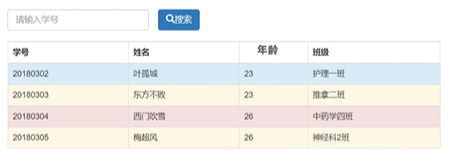
详见代码：[ArrayListStudentTest](code/src/ArrayList/ArrayListStudentTest.java)

```aidl
# 案例：开发一个ATM系统
```
详见代码：[ATM](code/src/ATM/ATMSystem.java)

## 10. static
### 10.1 成员变量
```aidl
static是静态的意思，可以修饰成员变量和成员方法；
static修饰成员变量表示该成员变量只在内存中存储一份，可以被共享访问、修改。

类名.静态成员变量（推荐）
对象.静态成员变量（不推荐）

public class User {
    public static int onlineNumber = 161;

    private String name;
    private int age;

    public static void main(String[] args) {
        // 理解static修饰成员变量的作用和访问特点
        // 1. 类名.静态成员变量
        System.out.println(User.onlineNumber); // 161

        // 2. 对象名.实例成员变量
        User u = new User();
        u.name = "Tom";
        u.age = 20;
        System.out.println(u.name);
        System.out.println(u.age);
        u.onlineNumber ++;
        System.out.println(u.onlineNumber); // 162 // 此种方法不推荐
        System.out.println(User.onlineNumber); // 162

        // 注意：同一个类中静态成员变量的访问可以省略类名
        System.out.println(onlineNumber); // 162
    }
}
```
详见代码：[User](code/src/Static/User.java)

### 10.2 成员变量内存机制


### 10.3 成员方法
```aidl
成员变量的分类：
静态成员方法（有static修饰，归属于类），建议用类名访问，也可以用对象访问；
实例成员方法（无static修饰，归属于对象），只能用对象触发访问。

使用场景：
（1）如果该方法是以执行一个公共功能为目的，可以声明为静态方法；
（2）表示对象自己的行为，且方法中需要访问实例成员的，则该方法必须声明为实例方法；

代码：
public class Student {
    private String name;

    // 静态成员方法
    public static int getMax(int age1, int age2){
        return age1 > age2 ? age1 : age2;
    }

    public void study(){
        System.out.println(name + "在好好学习，天天向上。");
    }

    public static void main(String[] args) {
        // 1. 类名.静态成员方法
        System.out.println(Student.getMax(10, 20));

        // 2. 对象名.实例方法
        Student s = new Student();
        s.name = "Tom";
        s.study();
    }
}
```
详见代码：[Student](code/src/Static/Student.java)

### 10.4 成员方法内存机制
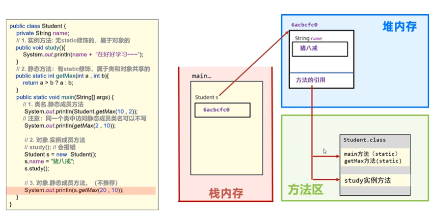

### 10.5 注意事项
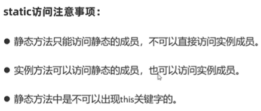
```aidl
public class Test {
    // 静态成员
    public static int onlineNumber = 10;
    public static void test(){
        System.out.println("==test==");
    }

    // 实例成员
    private String name;
    public void run(){
        System.out.println(name + "跑得快");
    }

    // 1. 静态方法只能访问静态成员，不能直接访问实例成员
    public static void test1(){
        // 访问静态成员变量
        System.out.println(onlineNumber);
        // 访问静态成员方法
        Test.test();

        // 但是不能直接访问实例成员变量/方法，需要先创建一个对象，然后访问
        Test t = new Test();
        System.out.println(t.name);
    }

    // 2. 实例方法可以访问静态成员，也可以访问实例成员
    public void test2(){
        // 访问静态成员变量
        System.out.println(onlineNumber);
        // 访问静态成员方法
        Test.test();

        // 访问实例成员变量
        System.out.println(name);
        // 访问实例成员方法
        run();
    }

    // 3. 静态方法中不可以出现this关键字
    public static void test3(){
        // System.out.println(this); // this只能代表当前对象，可以放在实例方法中
    }
}
```
详见代码：[Test](code/src/Static/Test.java)

### 10.6 工具类
```aidl
由于工具里面都是静态方法，直接用类名即可访问，因此，工具类无需创建对象，建议将工具类的构造器进行私有。

public class UtilTest {
    public static void main(String[] args) {
        Util.createVerifyCode(6);
    }
}

public class Util {
    // 注意：由于工具类无需创建对象，所以把其构造器私有化
    private Util(){
    }

    // 静态方法：生成N位验证码
    public static String createVerifyCode(int n) {
        // 1. 定义可能出现的字符
        String data = "abcdefghijklmnopqrstuvwxyzABCDEFGHIJKLMNOPQRSTUVWXYZ0123456789";

        // 2. 循环五次，每次随机生成一个索引，提取对应字符连接起来
        String code = "";
        Random r = new Random();
        for (int i = 0; i < n; i++) {
            // 随机一个索引
            int index = r.nextInt(data.length());
            char c = data.charAt(index);
            code += c;

        }

        // 3. 输出字符串
        System.out.println(code);

        // 4. 返回字符串
        return code;
    }
}
```
详见代码：[UtilTest](code/src/Static/UtilTest.java)

```aidl
# 练习：定义数组工具类
public class ArrayUtilTest {
    public static void main(String[] args) {
        int[] arr1 = null;
        int[] arr2 = {};
        int[] arr3 = new int[] {12, 13, 14, 15, 16};

        System.out.println(ArrayUtil.toString(arr1));   // null
        System.out.println(ArrayUtil.toString(arr2));   // []
        System.out.println(ArrayUtil.toString(arr3));   // [12,13,14,15,16]
    }
}

public class ArrayUtil {
    private ArrayUtil(){

    }

    public static String toString(int[] arr){
        if(arr == null){
            return null;
        }

        String result = "[";
        for (int i = 0; i < arr.length; i++) {
            result += (i == arr.length-1 ? arr[i] : arr[i] + ",");
        }
        result += "]";
        return result;
    }
}
```
详见代码：[ArrayUtilTest](code/src/Static/ArrayUtilTest.java)

### 10.7 代码块
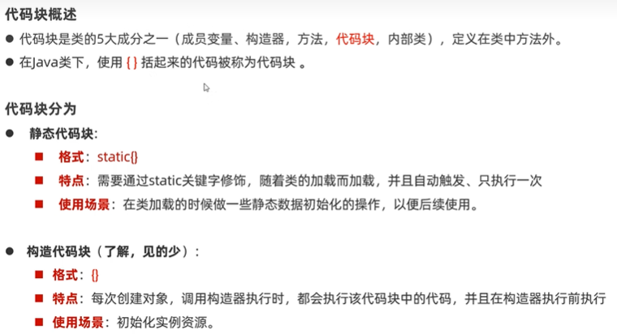
```aidl
public class StaticCode {
    public static String name;
    private int age;

    // 静态代码块：有static修饰，属于类，与类一起优先加载一次，自动触发执行
    // 作用：可以用于初始化静态资源
    static {
        System.out.println("---静态代码块被执行---");   // 它比main方法先执行
        name = "Tom";
        System.out.println(name);
    }

    // 实例代码块（构造代码块）：无static修饰，每次构造对象时，都会触发一次执行。
    // 作用：可以初始化实例资源
    {
        age = 10;
        System.out.println("---实例代码块被执行---");
    }

    public static void main(String[] args) {
        System.out.println("---main方法被执行---");
        System.out.println(name);

        StaticCode s1 = new StaticCode();
        StaticCode s2 = new StaticCode();
    }
}
```
详见代码：[StaticCode](code/src/Static/StaticCode.java)

```aidl
# 案例：斗地主游戏，需要提前准备好54张牌
public class StaticCodeTest {
    // 1. 定义一个静态的集合，只加载一次
    public static ArrayList<String> cards = new ArrayList<>();

    // 2. 在程序真正运行main方法前，将54张牌放进去
    static {
        // 定义一个数组存放全部点数
        String[] sizes = new String[]{"2", "3", "4", "5", "6", "7", "8", "9", "10", "J", "Q", "K", "A"};
        // 定义一个数组存放花色
        String[] colors = new String[]{"♥", "♦", "♠", "♣"};
        // 遍历
        for (int i = 0; i < sizes.length; i++) {
            for (int j = 0; j < colors.length; j++) {
                // 形成一张牌
                String card = sizes[i] + colors[j];
                cards.add(card);
            }
        }
        // 单独加入大小王
        cards.add("🃏");
        cards.add("🃏");
    }

    public static void main(String[] args) {
        System.out.println("新牌" + cards);
    }
}
```
详见代码：[StaticCodeTest](code/src/Static/StaticCodeTest.java)

### 10.8 单例模式
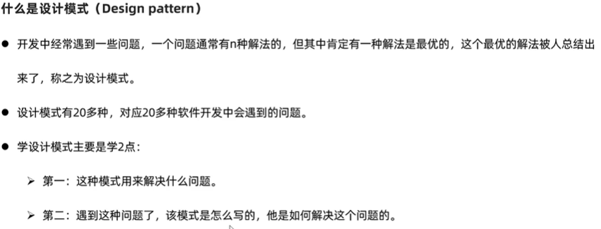
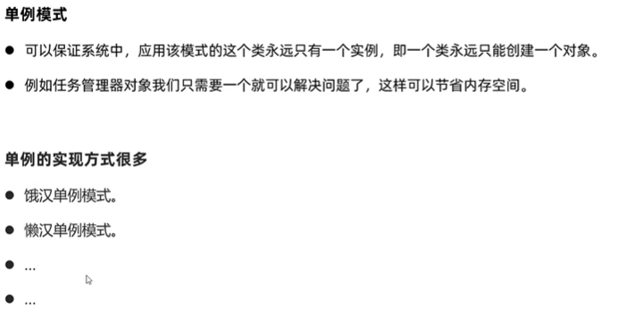
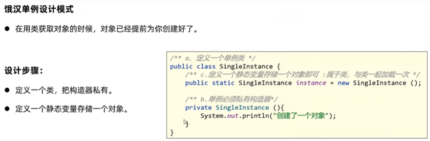
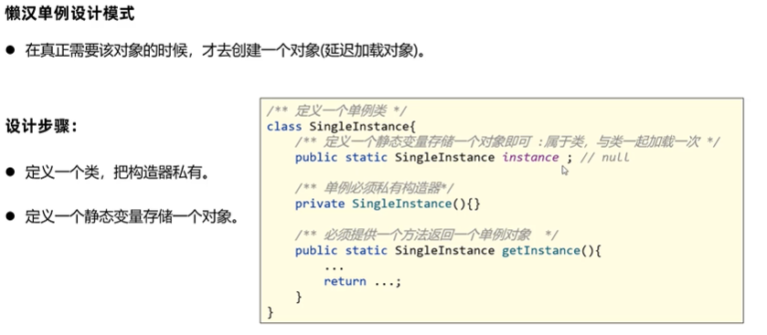
```aidl
# 饿汉单例
public class SingleInstance {
    // 饿汉单例
    // 1. 必须将构造器私有化
    private SingleInstance(){}

    // 2. 饿汉单例是在获取对象前，已经准备好了一个对象；这个对象只能是一个，所以定义静态成员变量要记住。
    public static SingleInstance instance = new SingleInstance();

    public static void main(String[] args) {

    }
}

public class SingleInstanceTest {
    public static void main(String[] args) {
        SingleInstance s1 = SingleInstance.instance;
        SingleInstance s2 = SingleInstance.instance;
        System.out.println(s1 == s2);   // true
    }
}
```
详见代码：[SingleInstanceTest](code/src/Static/SingleInstanceTest.java)

```aidl
# 懒汉单例
public class SingleInstance1 {
    // 使用懒汉单例
    // 1. 必须将构造器私有化
    private SingleInstance1(){}

    // 2. 定义一个静态的成员变量，存储一个对象，只加载一次，只有一份。
    private static SingleInstance1 instance;

    // 3. 提供一个方法，对外返回单例对象。
    public static SingleInstance1 getInstance(){
        if (instance==null){
            instance = new SingleInstance1();
        }
        return instance;
    }
}

public class SingleInstance1Test {
    public static void main(String[] args) {
        SingleInstance1 s1 = SingleInstance1.getInstance();
        SingleInstance1 s2 = SingleInstance1.getInstance();
        System.out.println(s1 == s2);   // true
    }
}
```
详见代码：[SingleInstance1Test](code/src/Static/SingleInstance1Test.java)

## 11. 继承
### 11.1 定义
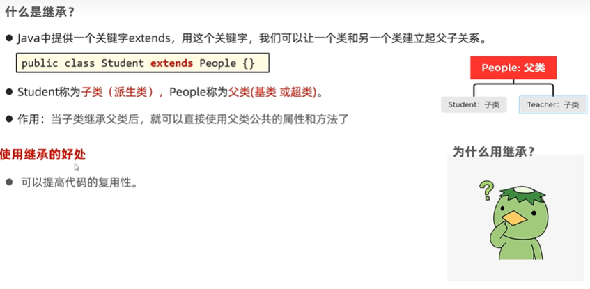
```aidl
public class People {
    public void run(){
        System.out.println("人会跑");
    }
}

public class Student extends People{
}

public class StudentTest {
    public static void main(String[] args) {
        Student s = new Student();
        s.run();
    }
}
```
详见代码：[StudentTest](code/src/Extends/StudentTest.java)

### 11.2 设计规范
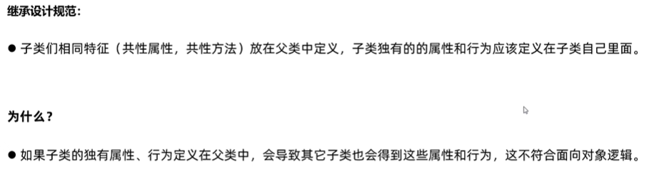
```aidl
# 案例：教学资源管理系统
public class People {
    private String name;
    private int age;

    // 查看课表
    public void queryCourse(){
        System.out.println(name + "在看课表");
    }

    public String getName() {
        return name;
    }

    public void setName(String name) {
        this.name = name;
    }

    public int getAge() {
        return age;
    }

    public void setAge(int age) {
        this.age = age;
    }

    public void run(){
        System.out.println("人会跑");
    }
}

public class Student extends People{
    public void writeInfo(){
        System.out.println(getName() + "在写字。");
    }
}

public class StudentTest {
    public static void main(String[] args) {
        Student s = new Student();
        s.run();

        // 继承设计思想
        s.setName("Tom");
        s.setAge(10);
        System.out.println(s.getName());
        System.out.println(s.getAge());

        s.queryCourse();
        s.writeInfo();
    }
}
```
详见代码：[StudentTest](code/src/Extends/StudentTest.java)

### 11.3 内存分析
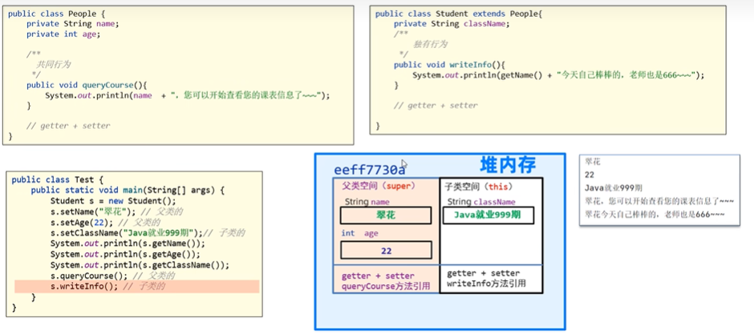

### 11.4 继承的特点
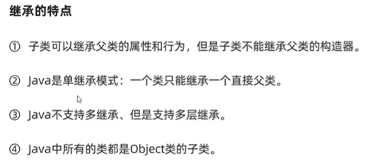
详见代码：[Feature](code/src/Extends/Feature.java)

### 11.5 访问成员


```aidl
public class Field {
    public static void main(String[] args) {
        Dog d = new Dog();
        d.showName();
    }
}

public class Animal {
    public String name = "动物名";
    public void run(){
        System.out.println("动物可以跑");
    }
}

public class Dog extends Animal{
    public String name = "狗名";

    public void lookDoor(){
        System.out.println("狗可以看门");
    }

    public void run(){
        System.out.println("狗可以跑");
    }

    public void showName(){
        String name = "局部名";
        System.out.println(name);           // 局部名
        System.out.println(this.name);      // 狗名
        System.out.println(super.name);     // 动物名

        run();                              // 狗可以跑
        super.run();                        // 动物可以跑
    }
}
```
详见代码：[Field](code/src/Extends/Field.java)

### 11.6 方法重写
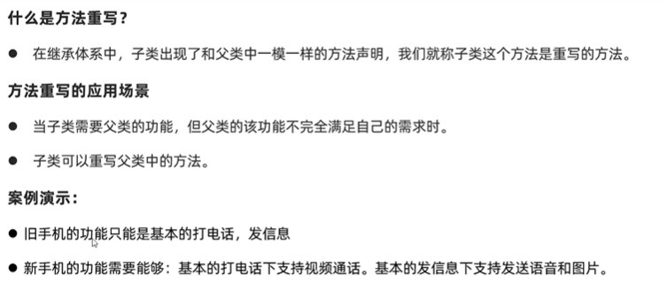
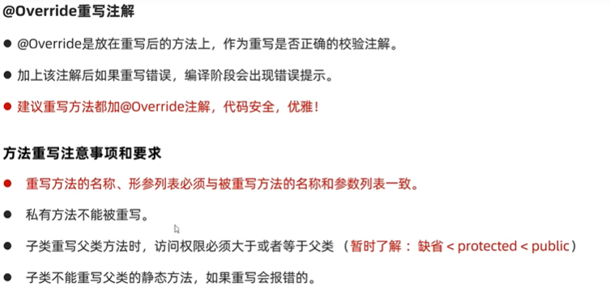
```aidl
public class Phone {
    public void call(){
        System.out.println("打电话");
    }

    public void sendMsg(){
        System.out.println("发短信");
    }
}

public class NewPhone extends Phone{
    // 方法重写
    @Override   // 重写校验注解，加上之后，这个方法必须是正确重写的，这样更安全。
    public void call(){
        super.call();
        System.out.println("视频通话");
    }

    @Override
    public void sendMsg(){
        super.sendMsg();
        System.out.println("发图片");
    }
}

public class NewPhoneTest {
    public static void main(String[] args) {
        NewPhone hw = new NewPhone();
        hw.call();
        hw.sendMsg();
    }
}
```
详见代码：[NewPhoneTest](code/src/Extends/NewPhoneTest.java)

### 11.7 子类构造器的特点
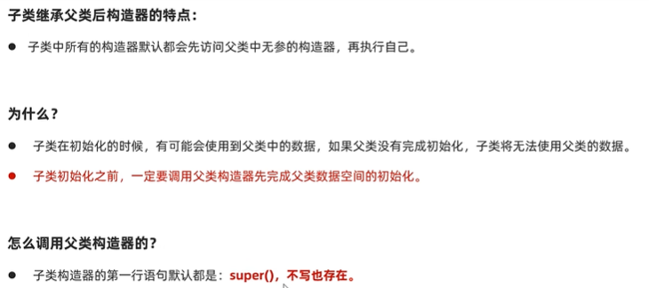
```aidl
public class Constructor {
    public Constructor(){
        System.out.println("父类无参构造器被执行");
    }
}

public class Constructor1 extends Constructor{
    public Constructor1() {
        super();    // 写不写都有，默认找父类的无参数构造器执行
        System.out.println("子类无参构造器被执行");
    }

    public Constructor1(String name) {
        super();    // 写不写都有，默认找父类的无参数构造器执行
        System.out.println("子类有参构造器被执行");
    }
}

public class ConstructorTest {
    public static void main(String[] args) {
        Constructor1 constructor1 = new Constructor1();
        System.out.println(constructor1);

        System.out.println("----------------");

        Constructor1 constructor2 = new Constructor1();
        System.out.println(constructor2);
    }
}
```
详见代码：[ConstructorTest](code/src/Extends/ConstructorTest.java)

### 11.8 调用父类有参构造器
```aidl
// 父类
public class People {
    private String name;
    private int age;

    // 有参构造器
    public People(String name, int age){
        this.name = name;
        this.age = age;
    }

    public String getName() {
        return name;
    }

    public void setName(String name) {
        this.name = name;
    }

    public int getAge() {
        return age;
    }

    public void setAge(int age) {
        this.age = age;
    }
}

// 子类
public class Teacher extends People{
    public Teacher(String name, int age){
        // 调用父类的有参构造器，初始化继承来自父类的数据
        super(name, age);
    }
}

public class Test{
    public static void main(String[] args){
        Teacher t = new Teacher("Tom", 20);
        System.out.println(t.getName());
        System.out.println(t.getAge());
    }
}
```

### 11.9 this和super对比
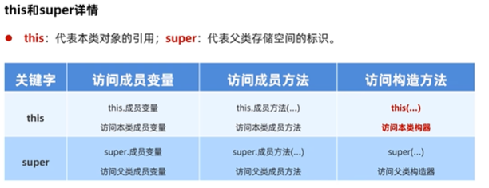
```aidl
public class This {
    private String name;
    private String schoolName;

    public This() {
    }

    // 如果不填schoolName，则此变量使用默认变量
    public This(String name){
        this(name, "SZU");
    }

    public This(String name, String schoolName) {
        this.name = name;
        this.schoolName = schoolName;
    }

    public String getName() {
        return name;
    }

    public void setName(String name) {
        this.name = name;
    }

    public String getSchoolName() {
        return schoolName;
    }

    public void setSchoolName(String schoolName) {
        this.schoolName = schoolName;
    }
}

public class ThisTest {
    public static void main(String[] args) {
        This s1 = new This("Tom", "HKU");
        System.out.println(s1.getName());
        System.out.println(s1.getSchoolName());

        // 如果不填写schoolName，则默认是SZU
        This s2 = new This("Jack");
        System.out.println(s2.getName());
        System.out.println(s2.getSchoolName());
    }
}
```
详见代码：[ThisTest](code/src/Extends/ThisTest.java)

## 12. 语法
### 12.1 包
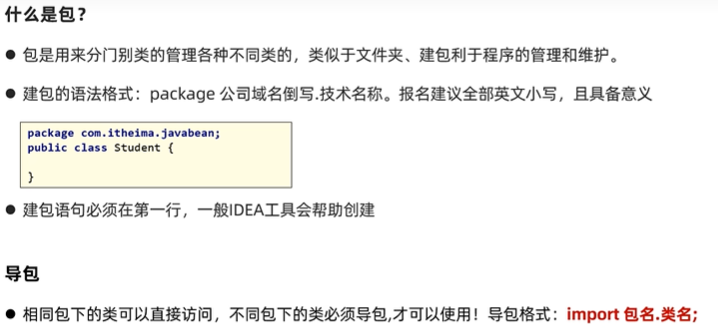

详见代码：[Package](code/src/Package/Test.java)

### 12.2 权限修饰符
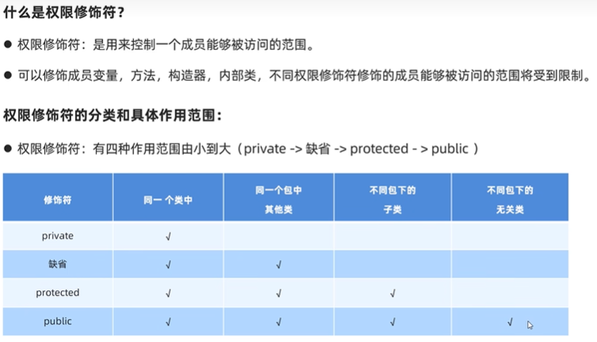
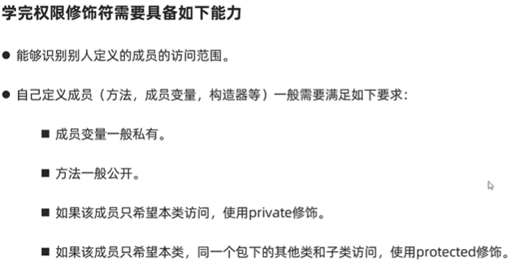

详见代码：[Test](code/src/Modifier/Fu.java)

### 12.3 final
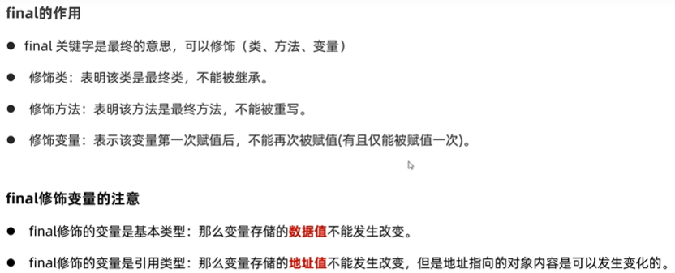

详见代码：[Test](code/src/Final/Test.java)

### 12.4 常量
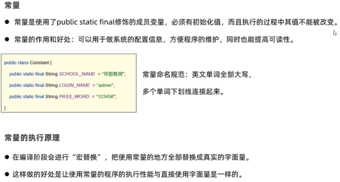

详见代码：[ConstantDemo1](code/src/Constant/ConstantDemo1.java)

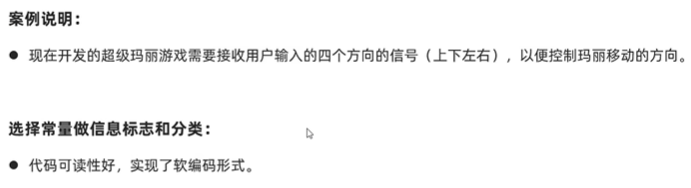

详见代码：[ConstantDemo2](code/src/Constant/ConstantDemo2.java)

### 12.5 枚举
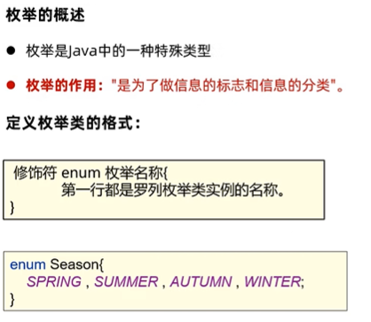
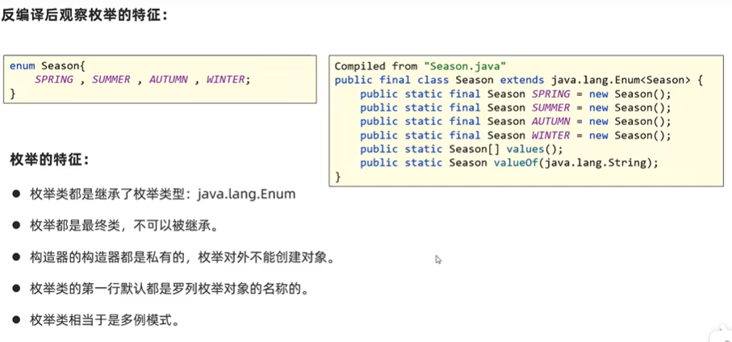
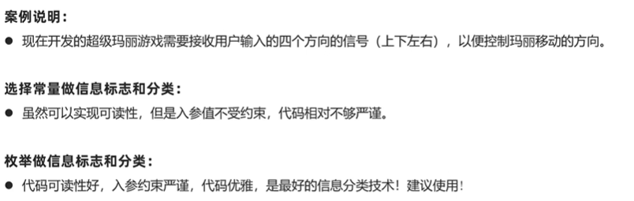

详见代码：[EnumDemo](code/src/Enum/EnumDemo.java)

### 12.6 抽象类

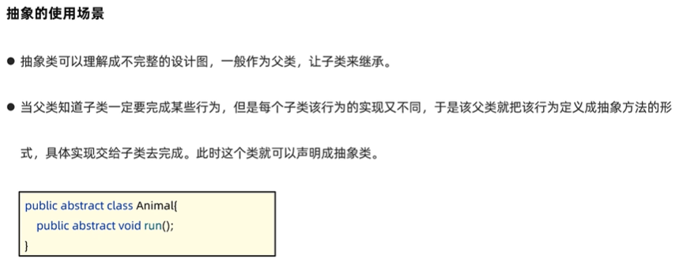

详见代码：[Test](code/src/Abstract/Test.java)

案例：

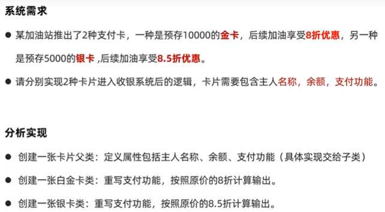

详见代码：[Demo1](code/src/Abstract/Demo1)

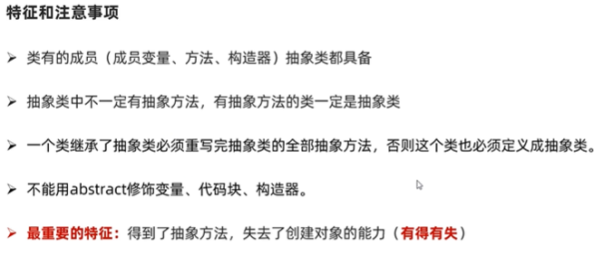
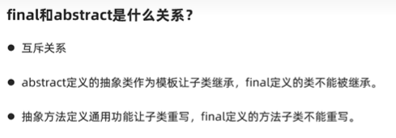

模板方法模式：

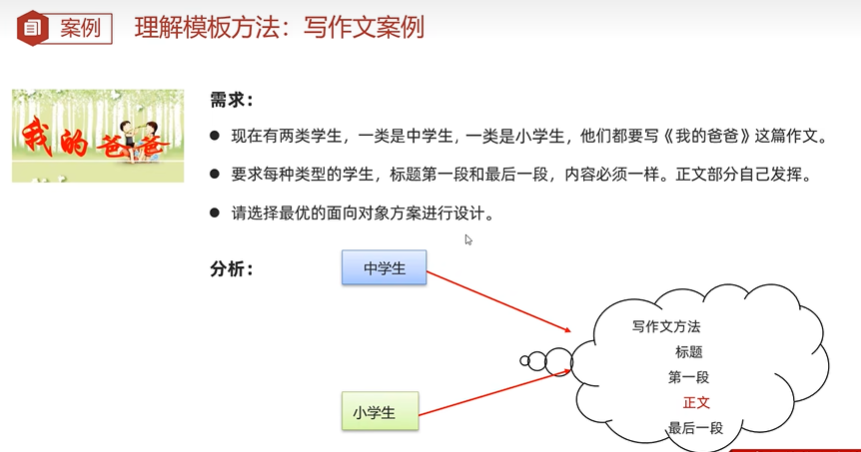
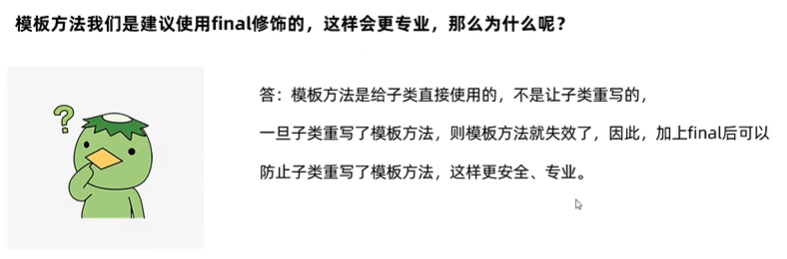

详见代码：[Demo2](code/src/Abstract/Demo2)


### 12.7 接口
#### 接口概述、特点

#### 接口的基本使用：被实现

#### 接口与接口的关系：多继承

#### JDK8开始接口新增方法

#### 使用接口的注意事项

## 13. 抽象类


## 14. 接口


## 15. 多态


## 16. 内部类


## 17. 常见API


## 18. 包装类


## 19. 正则表达式


## 20. Arrays


## 21. 选择排序


## 22. 二分查找


## 23. Lambda表达式


## 24. 集合


